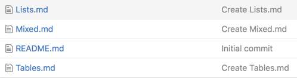

This is another test file where I try to mix html with md.

#Adding an image
This is what you need to do:

<ol>
<li>item is <b>bold</b></li>
<li>item is <i>italics</i></li>
</ol>

* first item
* second item
  * askdjf **lkjsldjf**
  * jaskldfö *lsjdlfkjsd*

And here is the image:

